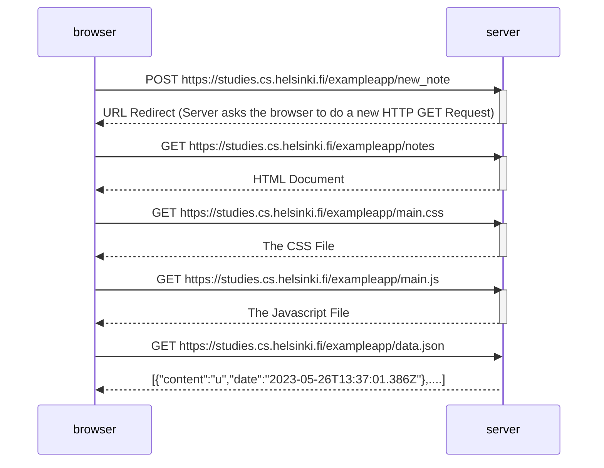

```mermaid
sequenceDiagram
    participant browser
    participant server

    browser->>server : POST https://studies.cs.helsinki.fi/exampleapp/new_note
    activate server
    server-->>browser : URL Redirect (Server asks the browser to do a new HTTP GET Request)
    deactivate server

    browser->>server : GET https://studies.cs.helsinki.fi/exampleapp/notes
    activate server
    server-->>browser : HTML Document
    deactivate server

    browser->>server : GET https://studies.cs.helsinki.fi/exampleapp/main.css
    activate server
    server-->>browser : The CSS File
    deactivate server

    browser->>server : GET https://studies.cs.helsinki.fi/exampleapp/main.js
    activate server
    server-->>browser : The Javascript File
    deactivate server

    browser->>server : GET https://studies.cs.helsinki.fi/exampleapp/data.json
    activate server
    server-->>browser : [{"content":"u","date":"2023-05-26T13:37:01.386Z"},....]
```
